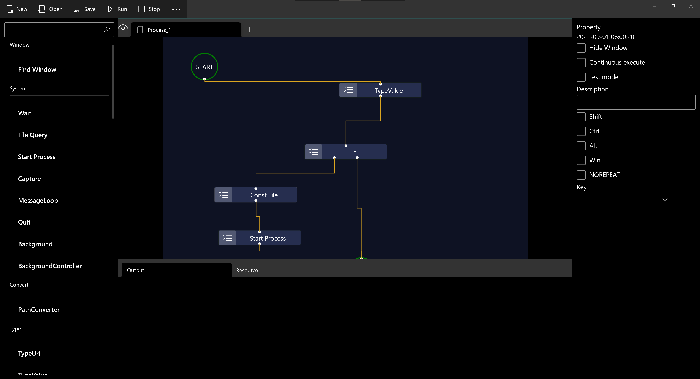

`WinUI` is developed by C++ and is a simplest `RPA` tool that runs on windows 10 1809 and above.

Ui

How to install on Windows 10?

1. [Intall by microsoft store](https://www.microsoft.com/store/productId/9N8HM4N6R77J)
2. [Install by Msix](https://youcarry.net/)

If you install by msix, please ref the flowing video:

[WinUI MSIX + 数字证书 安装过程演示](https://www.bilibili.com/video/BV1m44y1V7as?share_source=copy_web)
