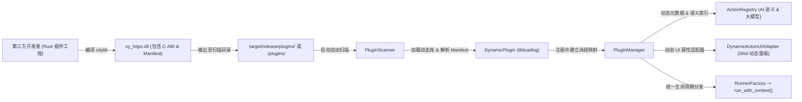

# XY Runner 原生动态库插件系统开发指南 (Native Plugin Guide)

欢迎使用 **XY Runner** 原生动态库插件开发生态！通过本系统，第三方开发者可以使用标准 Rust 开发高性能、无沙箱约束的原生工作流动作插件（`.dll` / `.so` / `.dylib`）。

---

## 1. 架构总览 (Architecture Overview)

XY Runner 插件系统采用基于 `libloading` 的原生动态库热加载架构：


```mermaid
graph LR
    Dev["第三方开发者 (Rust 插件工程)"] -->|编译 cdylib| Dll["xy_https.dll (包含 C-ABI & Manifest)"]
    Dll -->|输出至扫描目录| TargetPlugins["target/release/plugins/ 或 ./plugins/"]
    TargetPlugins -->|启动自动扫描| Scanner["PluginScanner"]
    Scanner -->|加载动态库 & 解析 Manifest| Loader["DynamicPlugin (libloading)"]
    Loader -->|注册并建立消歧映射| Manager["PluginManager"]
    Manager -->|动态元数据 & 语义索引| ActionReg["ActionRegistry (AI 语义 & 大模型)"]
    Manager -->|动态 UI 属性适配器| DynamicAdapter["DynamicActionUIAdapter (Slint 动态面板)"]
    Manager -->|统一生命周期分发| RunnerFactory["RunnerFactory -> run_with_context()"]
```

### 核心特性
1. **零沙箱限制 (Zero Sandbox Constraints)**：原生执行，可直接引入 Tokio、Axum、DuckDB、原生网络套接字与操作系统原生 API。
2. **极简标准接口 (`ActionRunner`)**：插件直接实现标准 `ActionRunner` trait (`load_data`, `run_with_context`)，与内置动作执行模型完全统一。
3. **安全内存生命周期 (Safe RAII Lifecycle)**：宿主通过 RAII Guard 包装裸指针，并在 `Drop` 时调用插件自身导出的 `xy_plugin_free_runner`，杜绝跨堆栈/跨分配器内存释放问题。
4. **多路径自动扫描 (Automatic Discovery)**：自动扫描 `target/debug/plugins/`、`target/release/plugins/`、`<exe_dir>/plugins/` 和 `./plugins/`。
5. **AI 语义推导与全限定名 (FQN)**：自动提取 Manifest 生成 JSON Schema，支持向量语义搜索与大模型槽位抽取；采用 `<plugin_id>::<tag>` 体系保障无命名冲突。

---

## 2. 官方示例：HTTP 服务插件 (`xy_https`)

官方提供的 `xy_https` 插件在 `run_with_context` 中启动了基于 **Axum** 和 **Tokio** 的多线程 HTTP 服务器，提供 3 个标准的 REST GET 接口：

| HTTP 路由 | 方法 | 功能说明 |
| :--- | :--- | :--- |
| `/api/v1/version` | `GET` | 查询当前应用版本信息与历史版本清单 |
| `/api/v1/latest_version` | `GET` | 查询最新版本发布说明 (Changelog)、发布日期与更新下载地址 |
| `/api/v1/features` | `GET` | 查询当前系统启用的全部特性功能列表与状态 |

### 插件输出目录
编译完成的动态库会自动放置在：
- `target/debug/plugins/xy_https.dll`
- `target/release/plugins/xy_https.dll`
- `plugins/xy_https.dll`

---

## 3. 快速上手：开发一个原生插件 (Quick Start)

### 3.1 创建插件工程
```bash
cargo new --lib my_plugin
```

### 3.2 配置 `Cargo.toml`
```toml
[package]
name = "my_plugin"
version = "0.1.0"
edition = "2024"

[lib]
crate-type = ["cdylib", "rlib"]

[dependencies]
xy_plugin_sdk = { path = "../xy_plugin_sdk" }
serde = { version = "1.0", features = ["derive"] }
serde_json = "1.0"
anyhow = "1.0"
log = "0.4"
```

### 3.3 编写元数据 `manifest.json`
```json
{
  "plugin_id": "my_plugin",
  "tag": "MyAction",
  "display_name": "我的原生动作",
  "group": "自定义 (Custom)",
  "description": "执行高性能原生数据计算与业务交互",
  "keywords": ["custom", "native", "compute"],
  "fields": [
    {
      "name": "input_text",
      "display_name": "输入文本",
      "intrinsic_type": "string",
      "default_type": "string",
      "default_value": "Hello XY",
      "presets": ["Hello XY", "Test Mode"],
      "description": "待处理的文本数据"
    }
  ],
  "output_type": "string",
  "version": "1.0.0"
}
```

### 3.4 编写插件实现 `src/lib.rs`
```rust
use xy_plugin_sdk::{xy_export_plugin, ActionRunner, ActionResult, ExecutionContext};

#[derive(Default)]
pub struct MyActionRunner {
    pub input_text: String,
}

impl ActionRunner for MyActionRunner {
    fn load_data(&mut self, data: &[u8], _version: u32) -> anyhow::Result<()> {
        if let Ok(val) = serde_json::from_slice::<serde_json::Value>(data) {
            if let Some(s) = val.get("input_text").and_then(|v| v.as_str()) {
                self.input_text = s.to_string();
            }
        }
        Ok(())
    }

    fn run_with_context(&self, ctx: &mut ExecutionContext) -> ActionResult {
        log::info!("Executing MyAction with text: {}", self.input_text);
        ctx.set_variable("my_result", format!("Processed: {}", self.input_text));
        ActionResult::string(format!("OK: {}", self.input_text))
    }
}

// 导出标准 C-ABI 符号
xy_export_plugin!(MyActionRunner, include_str!("../manifest.json"));
```

### 3.5 编译与部署
```bash
cargo build --release -p my_plugin
mkdir -p target/release/plugins
cp target/release/my_plugin.dll target/release/plugins/
```

---

## 4. 文档导航 (Documentation Index)

* [原生动态库 C-ABI 与生命周期规范 (`ABI_SPECIFICATION.md`)](./ABI_SPECIFICATION.md)
* [Manifest 元数据与 Tag 规范 (`MANIFEST_SCHEMA.md`)](./MANIFEST_SCHEMA.md)
* [Step-by-Step 官方插件开发实战 (`TUTORIAL_STEP_BY_STEP.md`)](./TUTORIAL_STEP_BY_STEP.md)
