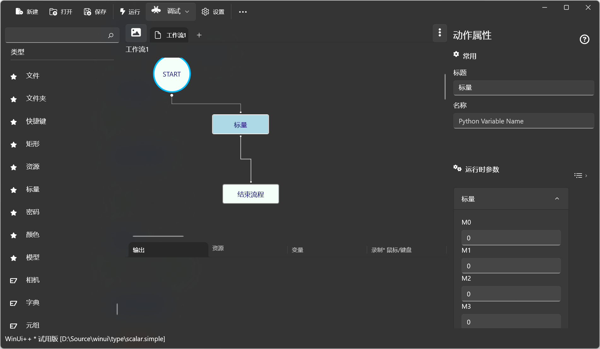

# 标� 
定义 *标�* 类��标�* 包� *4* 个数值�




## ���
> �支�


## �行�数


* �
> 包�四个数�`M0`�`M1`�`M2`�`M3`�

## 输出

> 标题，�考：[Scalar](/types/Scalar.md)�
    


## 脚本调用

```python
import simple;

s1 = simple.Scalar()

s2 = simple.Scalar(0,0,0,0)

```

## 示例


