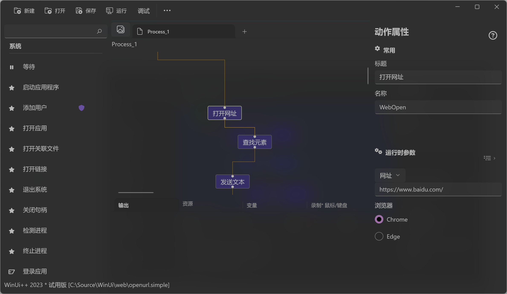

# 元素截图 
*Web* 元素截图或者页�截图�

## ���
> �支�

## �行�数

* 对象
>如��览器对象，则执行页�截图， 如��*Web* 元素，执行元素截�

## 输出

> 图�，[Image](/types/Image.md)    

## 示例

* �程：https://github.com/shelllet/WinUi/blob/main/web/screenshot.simple

