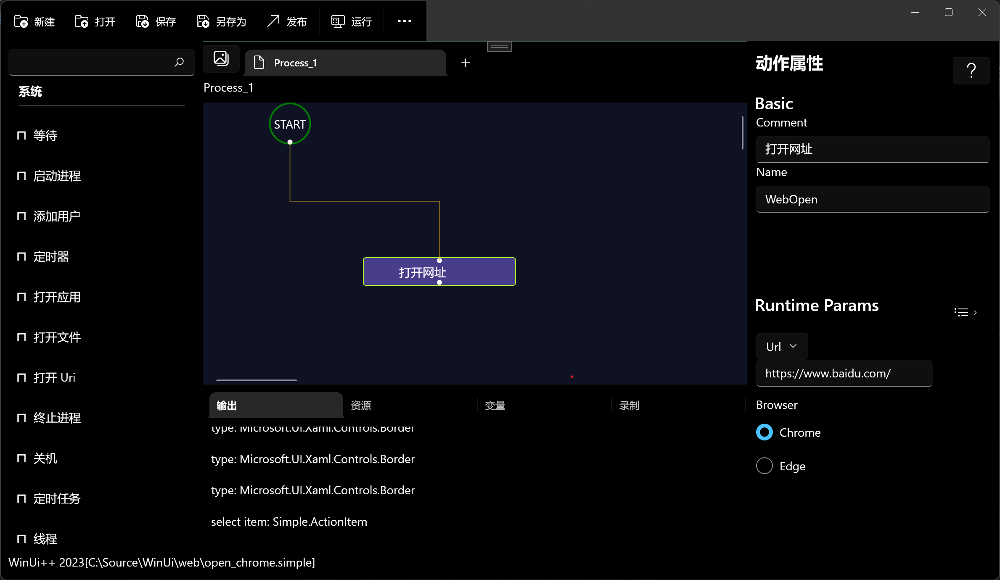

# 打开浏览器

打开浏览器，支持 _Chrome_ 和 *Edge* 浏览器。由于使用浏览器用户数据的 *Default* 配置，执行该动作之前需要退出已经打开的浏览器。

* *Edge* 浏览器将无法以管理员模式启动。这是微软出于安全原因而做出的明确决定。

## 子流程

> 不支持

## 运行参数

- 网址
  > 以`http://` 或者`https://`开头。若是本地文件，以`file:///` 开始， 后面跟上文件路径。
- 浏览器
  > 可以选择 谷歌 _Chrome_ 或者 微软 _Edge_ 浏览器。

- 用户目录

  > 参考[浏览器配置目录](./introduction/webdriver/browser_directory.md)。 由于浏览器的限制，如果该目录和浏览器的默认目录一致，需要在执行流程前退出当前已经打开的浏览器。
- 配置名称
  > 参考[浏览器配置目录](./introduction/webdriver/browser_directory.md)，配置目录名称。

## 输出
> 参考：[WebDriver](./types/WebDriver.md)

## 示例
* 流程：https://github.com/shelllet/WinUi/blob/main/web/openurl.simple

## 注意事項

  * 在 Windows 上使用 Selenium 讓 Chrome 載入預設的用戶資料目錄（User Data Directory）可以保留你的登錄狀態、瀏覽歷史、書籤和擴展程序等。但是新版的Chrome浏览器似乎不支持默认的用户配置。仍然会报出来「DevToolsActivePort」的错误。
  * **不要同時運行兩個 Chrome 實例：** 你不能在同一個時間，同時運行一個手動打開的 Chrome 瀏覽器和你用 Selenium 腳本啟動的、且使用相同用戶資料目錄的 Chrome 實例。這會導致「DevToolsActivePort」錯誤。
  * **路徑中的斜槓：** 在 Python 中，Windows 的路徑可以使用雙反斜槓 `\\` 或單正斜槓 `/`。在 Java 中，則需要使用雙反斜槓 `\\` 來作為轉義字元。
  * **不同作業系統的路徑：** 上述路徑是針對 Windows 10/11 的。如果你在 macOS 或 Linux 上，路徑會不同。你可以同樣使用 `chrome://version/` 來找到對應的正確路徑。

## 驱动

该动作如果首次运行，会检测驱动缓存目录：`%LOCALAPPDATA%\Simple\selenium` 是否有上表列出的相对应的浏览器驱动，如果不存在，则会下载相应的浏览器驱动。因此需要网络连接或者手动下载驱动放置在该目录。若需要手动下载，请参考：[浏览器 WebDriver 驱动](./introduction/webdriver/download.md)。

!> 由于浏览器的安全策略限制，使用管理员身份执行该动作，可能导致失败！

## 版本变化
- 0.46
> 新增加 `用户目录` 和 `配置名称` 运行时参数。